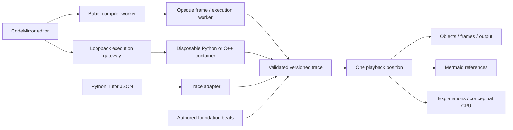

# Code Studio

Open `/code-studio`, or use **Code Studio** in the workspace header.

The preview includes a resizable CodeMirror editor, real synchronous JavaScript
execution, reversible trace playback, visible object changes, stack frames,
Mermaid reference graphs, an explicitly conceptual computer view, guided
foundations, checkpoints, local draft/progress persistence, and JSON trace
import/export. Python Tutor trace imports use the currently selected language.

## What runs today

| Language   | Execution                                                             | Important boundaries                                                                                                                                                                   |
| ---------- | --------------------------------------------------------------------- | -------------------------------------------------------------------------------------------------------------------------------------------------------------------------------------- |
| JavaScript | Browser worker inside an opaque sandbox frame                         | Synchronous scripts; no imports, DOM, network, async functions or generators. Native calls are atomic source steps.                                                                    |
| Python     | CPython tracing in a disposable Docker container                      | Requires the separately configured runner. Standard library available, no network or third-party package installation. Native internals are opaque.                                    |
| C++        | GCC C++20 and GDB source breakpoints in a disposable Docker container | Requires the runner and working GDB/ptrace support. Native internals, threads, and undefined behavior are not faithfully visualized. STL children depend on installed pretty printers. |

There is deliberately no claim to support **every program** or **every data
structure semantically**. Code can require packages, OS facilities, hardware,
multiple processes, asynchronous work, or interactive environments absent here.
The generic object graph can display arbitrary connected captured objects,
including cycles and shared references; it cannot automatically prove that an
object is a red-black tree, trie, or some application-specific structure.

The CPU diagram teaches a model. It does not measure registers, cache activity,
instructions, CPU cycles, memory bytes, or execution timing. Recorded state
changes and authored lessons are visibly distinguished. No AI guesses are
substituted for missing runtime state.

## Architecture extracted from the requested projects

Reviewed and pinned:

- [Pathrise Python Tutor](https://github.com/pathrise-eng/pathrise-python-tutor/tree/53253554f6fdb9176cb90e54df38b508d9529235)
  — `v5-unity/pg_logger.py`, `pg_encoder.py`, and `v3/docs/opt-trace-format.md`.
  Extracted the separation between tracing and rendering, self-contained
  snapshots, stable object identities, reference edges, per-call locals, and
  bounded recordings. The adapter in `python-tutor.ts` directly consumes the
  documented `REF`, `LIST`, `TUPLE`, `SET`, `DICT`, `INSTANCE`, globals, heap,
  and `stack_to_render` representations. Unrecognized encodings remain visible
  as generic data rather than being silently interpreted as a known structure.
- [alg0.dev](https://github.com/midudev/alg0.dev/tree/1d6960a67a96135b3209297a2d450e4889bf324a)
  — `src/lib/visualizers/render-step.ts`, `bind-step-viz.ts`, and the bubble-sort
  content module. Extracted the shared playback position, renderer dispatch,
  variable tracking, source highlighting, and per-step teaching content.

This is a new React implementation. It does not embed either application or
contact their execution servers. Their older runtime/deployment dependencies
are not introduced into the reader. Source attribution and the Pathrise MIT
notice are in `public/code-studio-notices.txt`.

`protocol.ts` is the versioned boundary. Each snapshot stores line/event, frame
locals, a graph of visible objects, and cumulative stdout. `operations.ts`
derives only observable changes; named semantic lessons can explicitly annotate
operations such as enqueue or visit. `motion.ts` stores reusable animation
primitives and handles real two-cell swap motion. Renderer state comes entirely
from the selected snapshot, so backward stepping is deterministic.

## Limits and preservation of meaning

- 50,000 source characters; 2,000 recorded steps; 100 visible objects; depth 8;
  200 entries per object; 20,000 output characters. Omitted values are labeled.
- Browser execution terminates after 8 seconds; compilation after 20 seconds.
  Cancellation, edits, and language changes invalidate outstanding runs.
- Python Tutor imports preserve the producer's before-line convention. No
  guessed line numbers are attached to cross-language authored lessons.
- Source instrumentation changes execution overhead. Use an external profiler
  for performance claims. JavaScript getters are not intentionally evaluated by
  the object inspector; proxies can still interpose on reflection.
- C++ final memory is the last source breakpoint, not live memory after process
  teardown. Invalid pointers and optimized/unavailable values are labeled.
- Object identities do not imply physical layout. C++ stack objects are not
  mislabeled as heap allocations; the UI calls the unified view an object store.
- Draft persistence is best effort. Export traces when retaining work matters.

## Runner setup

See [services/code-runner/README.md](../services/code-runner/README.md).
No public execution service is deployed by this change. The default static app
works immediately for guided lessons and synchronous JavaScript.

Configure local execution through an ignored `.env.local` file with
`VITE_CODE_RUNNER_URL=http://127.0.0.1:4318`. The gateway can run in Ubuntu/WSL
with the restricted Docker image. Start it using the runner README.
Do not carry this loopback endpoint into a public deployment configuration.

## Verification

The JavaScript runtime has 15 tests covering arbitrary edited code, aliases,
cycles, recursion, closures, getters, limits, input, imports and course examples.
The Python tracer has six tests. Six integration tests use the real restricted
Docker runner, including GCC/GDB execution, STL values, pointer cycles,
compilation diagnostics and disabled networking. All 27 programs in the nine
lessons have executed successfully in their respective language runtimes.

The browser suite covers editing, recorded memory, Mermaid, guided swaps,
checkpoint persistence, syntax and infinite-loop recovery, unavailable runners,
actual Python/C++ execution (opt-in), browser isolation and mobile interactions.
Recorded JavaScript runs use a fresh isolated worker each time; the trusted
compiler is reused between edits and released after a minute idle.

## Extending coverage

Add a runtime adapter that produces the validated trace contract, rather than
teaching the renderer another source language. Add explicit semantic annotations
for specialized structures; avoid guessing that an arbitrary integer increment
or object update proves a high-level algorithm operation. Add lessons with code
in all three languages, explicit teaching beats, and checkpoints. Keep authored
models distinct from recorded runs. The operation library is intentionally
extensible, not an enumeration of every operation in computer science.

Future work for universal coverage includes async scheduling traces, module and
package environments, semantic structure adapters, richer C++ lifetime tracking,
opcode/instruction-level tracing, and measured profiling integrations.
