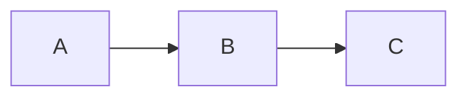

:::question{#ga-1 section=GA type=mcq marks=1 topic=ga.verbal difficulty=easy time=60 tags=sample}
Choose the closest meaning of **concise**.

- Brief
- Angry
- Uncertain
- Lengthy
:::

:::question{#ga-2 section=GA type=mcq marks=2 topic=ga.quant difficulty=easy time=60 tags=sample}
A price rises from 80 to 100. What is the percentage increase?

- 20%
- 25%
- 80%
- 125%
:::

:::question{#da-1 section=DA type=nat marks=2 topic=la.eigen difficulty=medium time=60 tags=sample}
For $A=\begin{pmatrix}2&0\\0&3\end{pmatrix}$, enter $\det(A)$.

:::

:::question{#da-2 section=DA type=mcq marks=2 topic=prob.bayes difficulty=medium time=60 tags=sample}
If $P(A\cap B)=0.2$ and $P(B)=0.5$, find $P(A\mid B)$.

- 0.2
- 0.1
- 0.4
- 0.7
:::

:::question{#da-3 section=DA type=nat marks=2 topic=calc.grad difficulty=hard time=60 tags=sample}
Find the positive stationary point of $f(x)=x^3-3x$.

:::

:::question{#da-4 section=DA type=msq marks=1 topic=la.eigen difficulty=easy time=60 tags=sample}
Which statements hold for the identity matrix?

- All eigenvalues are 1
- It is invertible
- Its determinant is 0
- It is singular
:::

:::question{#da-5 section=DA type=mcq marks=2 topic=prob.stats difficulty=easy time=60 tags=sample}
For an unbiased sample variance from $n$ observations, what is the denominator?

- n
- n-1
- n+1
- 1
:::

:::question{#da-6 section=DA type=mcq marks=2 topic=prob.stats difficulty=easy time=60 tags=sample}
If $P(A\cap B)=0.1$ and $P(B)=0.2$, what is $P(A\mid B)$?

- 0.1
- 0.5
- 0.02
- 0.2
:::

:::question{#da-7 section=DA type=mcq marks=2 topic=prog difficulty=easy time=60 tags=sample}
Which node can be reached from A?



- D
- C
- E
- F
:::

:::question{#da-8 section=DA type=mcq marks=2 topic=ga.quant difficulty=easy time=60 tags=sample}
Which category has the largest value?

```chart
{"type":"bar","data":[{"name":"A","value":3},{"name":"B","value":7},{"name":"C","value":4}],"series":[{"key":"value","name":"Count"}],"xKey":"name"}
```

- A
- B
- C
- All equal
:::

:::question{#da-9 section=DA type=mcq marks=2 topic=calc.grad difficulty=easy time=60 tags=sample}
What is the derivative of $x^2$?

- -2x
- 2x
- x
- 2
:::

:::question{#da-10 section=DA type=msq marks=2 topic=ml difficulty=medium time=60 tags=sample}
Which are supervised learning tasks?

- Classification with labels
- Regression with targets
- Unsupervised clustering
- Unlabeled density estimation
:::
