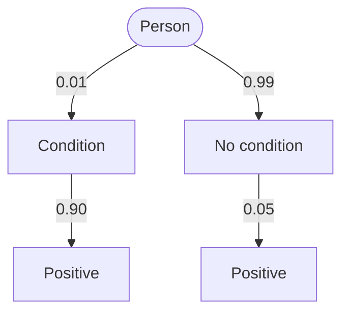

# Example: a valid exam, its rules and a practice set

Three files that Localdox reads cleanly. Every one was checked with Localdox's own parsers and with `localdox_check.py`. Copy the shapes, change the content.

What to notice:

- The paper's header names its rules file exactly, so the pair links wherever the files sit.
- `questionCount` (6) equals the number of `:::question` blocks.
- Every exam question has `difficulty`; no `topic=`. Ids are `q1`…`q6`, without dots.
- `q4` puts numbered statements before bulleted options, so the two lists don't merge.
- NAT keys are decimals: exact (`0.75`) when the answer is exact, a range (`"0.66:0.67"`) when it is rounded.
- Solutions follow all the questions, under `# Solutions`, and each one names the tempting wrong answer.
- The practice set has no header and no `marks`; its headings group questions, and each solution sits right after its question.

## `probability-mock-1.xrule`

````json
{
  "xrule": 1,
  "name": "Probability mock 1",
  "summary": "- Events, independence and mutually exclusive events\n- Conditional probability and Bayes' theorem\n- Binomial distribution, expectation and variance\n- Continuous random variables: uniform, order statistics",
  "durationMinutes": 15,
  "questionCount": 6,
  "passPercentage": 60,
  "maxAttempts": 3,
  "mcqPenalty": "third",
  "calculator": "basic"
}
````

## `probability-mock-1.xam`

````markdown
---
rules: probability-mock-1.xrule
---

# Exam

:::question{#q1 type=mcq marks=1 difficulty=easy}
Events $A$ and $B$ are independent, with $P(A) = 0.5$ and $P(B) = 0.4$. Find $P(A \cup B)$.

- $0.2$
- $0.7$
- $0.9$
- $0.5$
:::

:::question{#q2 type=msq marks=2 difficulty=medium}
Events $A$ and $B$ are mutually exclusive, with $P(A) > 0$ and $P(B) > 0$. Which of the following are true?

- $A$ and $B$ cannot be independent.
- $P(A \cup B) = P(A) + P(B)$
- $P(A \mid B) = P(A)$
- $P(A^c \cap B^c) = 1 - P(A) - P(B)$
:::

:::question{#q3 type=nat marks=2 difficulty=medium}
Urn 1 holds 3 red and 2 blue balls; urn 2 holds 1 red and 4 blue. A fair coin picks the urn, then one ball is drawn. The ball is red. Find the probability that it came from urn 1, to two decimal places.
:::

:::question{#q4 type=mcq marks=2 difficulty=medium tags=pyq-style}
Let $X \sim \text{Binomial}(n = 4, p = \tfrac12)$. Consider the statements:

1. $E[X] = 2$
2. $\operatorname{Var}(X) = 1$
3. $P(X = 2) = \tfrac12$

Which of the statements are correct?

- 1 only
- 1 and 2 only
- 2 and 3 only
- 1, 2 and 3
:::

:::question{#q5 type=nat marks=2 difficulty=hard}
$U_1$ and $U_2$ are independent, each uniform on $[0, 1]$. Let $Y = \max(U_1, U_2)$. Find $E[Y]$ to two decimal places.
:::

:::question{#q6 type=mcq marks=1 difficulty=medium}
A discrete random variable $X$ has this distribution:

```chart
{"type":"bar","title":"P(X = x)","data":[{"x":"0","p":0.1},{"x":"1","p":0.3},{"x":"2","p":0.4},{"x":"3","p":0.2}],"series":[{"key":"p","name":"Probability"}],"xKey":"x"}
```

Find $E[X]$.

- $1.5$
- $1.7$
- $2.0$
- $1.2$
:::

# Solutions

:::solution{#q1 answer=B}
Independence gives $P(A \cap B) = 0.5 \times 0.4 = 0.2$, so

$$P(A \cup B) = 0.5 + 0.4 - 0.2 = 0.7$$

**Trap:** $0.9$ adds the probabilities as if the events were mutually exclusive.
:::

:::solution{#q2 answer="A,B,D"}
Mutually exclusive means $P(A \cap B) = 0$.

- **A** is true: independence would need $P(A \cap B) = P(A)P(B) > 0$.
- **B** is true: the overlap term is zero.
- **C** is false: $P(A \mid B) = 0 \ne P(A)$.
- **D** is true: $P(A^c \cap B^c) = 1 - P(A \cup B) = 1 - P(A) - P(B)$.
:::

:::solution{#q3 answer=0.75}
$$P(U_1 \mid R) = \frac{\tfrac12 \cdot \tfrac35}{\tfrac12 \cdot \tfrac35 + \tfrac12 \cdot \tfrac15} = \frac{0.3}{0.4} = 0.75$$

**Trap:** $0.6$ is $P(R \mid U_1)$, the reverse conditional.
:::

:::solution{#q4 answer=B}
$E[X] = np = 2$ and $\operatorname{Var}(X) = np(1-p) = 1$, so statements 1 and 2 hold. But $P(X = 2) = \binom42 / 2^4 = 6/16 = 0.375$, so statement 3 is false.
:::

:::solution{#q5 answer="0.66:0.67"}
$P(Y \le y) = y^2$ on $[0, 1]$, so $f_Y(y) = 2y$ and

$$E[Y] = \int_0^1 y \cdot 2y \, dy = \tfrac23 \approx 0.667$$

Any value from 0.66 to 0.67 is accepted.
:::

:::solution{#q6 answer=B}
$E[X] = 0(0.1) + 1(0.3) + 2(0.4) + 3(0.2) = 1.7$.
:::
````

## `conditional-probability.xp`

````markdown
# Warm-up

:::question{#cp1 type=mcq difficulty=easy}
A fair die shows an even number. What is the probability that it is a 6?

- $\tfrac16$
- $\tfrac13$
- $\tfrac12$
- $\tfrac23$
:::

:::solution{#cp1 answer=B}
Given "even", the outcomes are $\{2, 4, 6\}$, and one of the three is a 6: $\tfrac13$.
:::

:::question{#cp2 type=nat difficulty=easy}
$P(A \cap B) = 0.12$ and $P(B) = 0.4$. Find $P(A \mid B)$.
:::

:::solution{#cp2 answer=0.3}
$P(A \mid B) = \dfrac{P(A \cap B)}{P(B)} = \dfrac{0.12}{0.4} = 0.3$.
:::

# Exam level

:::question{#cp3 type=nat difficulty=medium}
1% of a population has a condition. A test detects it 90% of the time and gives a false positive 5% of the time. A person tests positive. Find the probability that they have the condition, to three decimal places.
:::

:::solution{#cp3 answer="0.152:0.155"}
Draw the tree first:



$$P(C \mid +) = \frac{0.01 \times 0.90}{0.01 \times 0.90 + 0.99 \times 0.05} = \frac{0.009}{0.0585} \approx 0.154$$

Most positives come from the large healthy group, so a positive result is far from certain.
:::

:::question{#cp4 type=msq difficulty=medium}
For events with $P(A) > 0$ and $P(B) > 0$, which statements always hold?

- $P(A \cap B) = P(A \mid B)\,P(B)$
- $P(A \mid B) = P(B \mid A)$
- $P(A \mid B) + P(A^c \mid B) = 1$
- $P(A \mid B) \ge P(A \cap B)$
:::

:::solution{#cp4 answer="A,C,D"}
- **A**: the multiplication rule.
- **B** fails in general: $P(A \mid B) = P(B \mid A)\,P(A)/P(B)$.
- **C**: given $B$, either $A$ or $A^c$ happens.
- **D**: $P(A \mid B) = P(A \cap B)/P(B)$ and $P(B) \le 1$.
:::
````

## Delivering them

**As loose files:** the learner opens an Exam Workspace, chooses **+ ▸ Upload files** and selects all three at once.

**As a workspace with folders:** put them in a folder tree and pack it.

```text
course/
  probability-mock-1.xrule
  01 Probability/
    probability-mock-1.xam
    conditional-probability.xp
```

```bash
python localdox_check.py --build course probability-course.json "Probability course"
```

`--build` checks every file first and writes nothing if any check fails. The learner imports `probability-course.json` with Settings ▸ Workspace ▸ Transfer ▸ **Import workspace**, which creates an Exam Workspace with the folder `01 Probability`. The `.xrule` sits at the workspace root, listed under Settings ▸ Exam rules.
