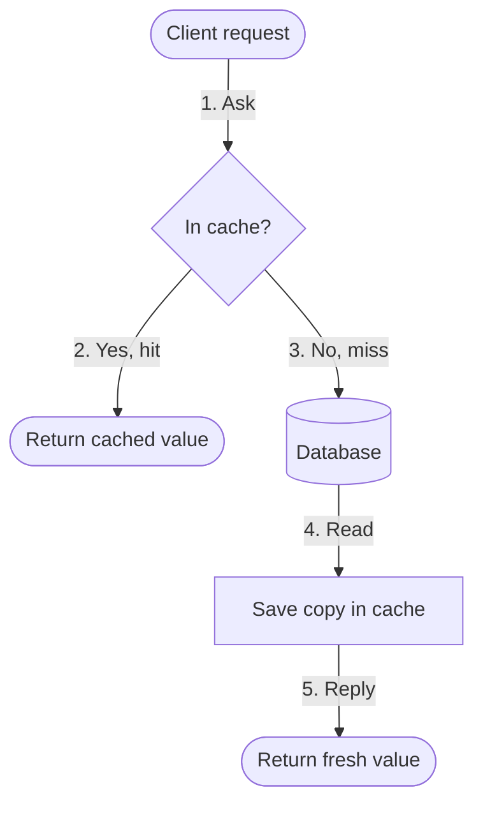
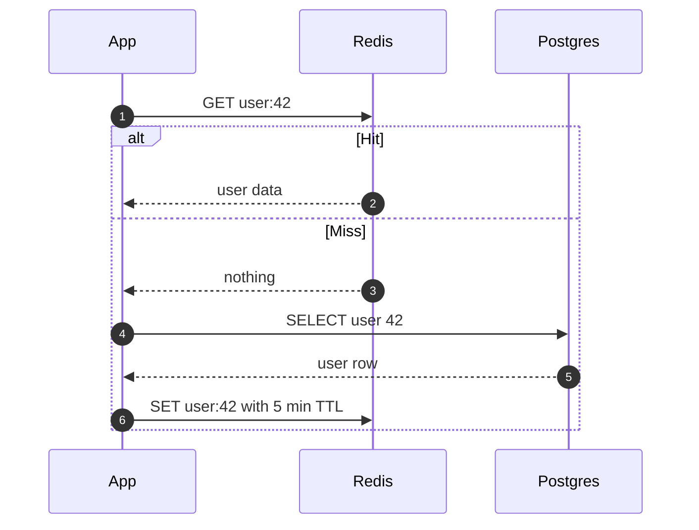

# How Caching Works

**You will understand:** why a cache makes systems fast, what happens on a hit and a miss, and how to reason about whether a cache is worth it.

> [!NOTE]
>
> **In one breath:** a cache is a small, fast copy of data you asked for recently. Asking the copy is cheap; asking the original is expensive. Speed comes from how often the copy already has the answer.

## The big picture

Think of a kitchen. The pantry holds everything but is a walk away. The counter holds the few things you are cooking with right now. You check the counter first, and only walk to the pantry when the counter does not have it. Then you leave the item on the counter, because you will probably need it again.

That counter is a **cache**. The pantry is the **origin** (a database, a disk, a remote service). Finding the item on the counter is a **cache hit**; walking to the pantry is a **cache miss**.

## Map of the topic

```mindmap
{
  "name": "Caching",
  "children": [
    {
      "name": "Why it works",
      "summary": "Programs reuse the same data soon after first using it.",
      "children": [
        { "name": "Temporal locality", "summary": "Data used now is likely to be used again soon." },
        { "name": "Spatial locality", "summary": "Data near what you used is likely to be used next." }
      ]
    },
    {
      "name": "Where caches live",
      "children": [
        { "name": "CPU cache", "summary": "Nanoseconds. Built into the processor." },
        { "name": "Browser cache", "summary": "Keeps images and scripts from earlier visits." },
        { "name": "CDN", "summary": "Copies of files in data centres near the user." },
        { "name": "App cache", "summary": "Redis or Memcached in front of a database." }
      ]
    },
    {
      "name": "Hard parts",
      "children": [
        { "name": "Invalidation", "summary": "Knowing when the copy no longer matches the original." },
        { "name": "Eviction", "summary": "Choosing what to throw away when the cache is full." },
        { "name": "Stampedes", "summary": "Many misses for the same key hitting the origin at once." }
      ]
    }
  ]
}
```

## How a read works

Play this diagram in **Stepped** mode to walk it one arrow at a time, or **Flow** mode to watch a hit and then a miss travel through it.



1. The client asks the cache first, because the cache is cheap to ask.
2. **Hit:** the answer is already there. Done in a fraction of a millisecond.
3. **Miss:** the cache does not have it, so the request goes to the database.
4. The value is copied into the cache on the way back.
5. The client gets its answer, and the next request for the same key will hit.

This pattern is called **cache-aside** (or lazy loading): the application, not the cache, decides when to fill it.

## The same read, message by message



## What a cached entry looks like

```json
{
  "key": "user:42",
  "value": {
    "id": 42,
    "name": "Ada",
    "plan": "pro"
  },
  "ttlSeconds": 300,
  "storedAt": "2026-09-29T10:15:00Z"
}
```

The **TTL** (time to live) is the entry's expiry timer. When it runs out, the next read misses and fetches a fresh value.

## Is the cache worth it?

If a fraction $h$ of reads hit the cache, the average time per read is:

$$
T = h \, t_{\text{cache}} + (1 - h) \, t_{\text{origin}}
\label{eq:effective-latency}
$$

With $t_{\text{cache}} = 1$ ms, $t_{\text{origin}} = 50$ ms and $h = 0.9$, {{eq:effective-latency}} gives $T = 0.9 + 5 = 5.9$ ms. That is about 8× faster than no cache. Notice that the misses dominate: raising $h$ from 0.9 to 0.99 cuts $T$ to about 1.5 ms.

> [!TIP]
>
> Improving the hit rate usually pays more than making the cache itself faster.

## Try it

Move the slider to see how the hit rate changes the average read time from {{eq:effective-latency}}.

```interactive-html
<label for="h">Hit rate: <strong id="hv">90%</strong></label>
<input id="h" type="range" min="0" max="100" value="90" style="width:100%">
<p>Average read: <strong id="t"></strong></p>
<script>
  const input = document.getElementById("h");
  const update = () => {
    const h = input.value / 100;
    document.getElementById("hv").textContent = input.value + "%";
    document.getElementById("t").textContent = (h * 1 + (1 - h) * 50).toFixed(1) + " ms";
  };
  input.addEventListener("input", update);
  update();
</script>
```

## Write strategies compared

| Strategy | On write | Strength | Weakness |
| :-- | :-- | :-- | :-- |
| Cache-aside | Write to DB, delete the key | Simple; cache holds only what is read | First read after a write is a miss |
| Write-through | Write to cache and DB together | Cache is always fresh | Every write is slower |
| Write-back | Write to cache, DB later | Fastest writes | Data lost if the cache dies first |

## Key terms

| Term | Plain meaning |
| :-- | :-- |
| Hit / miss | The cache had / did not have the answer |
| Hit rate | Share of reads that were hits |
| TTL | How long an entry stays valid |
| Eviction | Removing entries to make room |
| LRU | Evict the least recently used entry first |
| Invalidation | Removing an entry because the original changed |

## Common mistakes

> [!WARNING]
>
> **Caching without an expiry.** Without a TTL or an invalidation rule, a cache serves stale data forever. Every cached value needs an answer to "when does this stop being true?"

> [!CAUTION]
>
> **Cache stampede.** When a popular key expires, thousands of requests can miss together and flood the database. Refresh hot keys before they expire, or let only one request rebuild the value.

## Check yourself

1. A cache has a 50% hit rate. Is it helping much? Use {{eq:effective-latency}} with the numbers above.
2. Why does cache-aside delete the key on write instead of updating it?
3. Which write strategy would you avoid for bank balances, and why?

### Answers

1. $T = 0.5 + 25 = 25.5$ ms. That is about 2× faster, far less than the 8× at 90%.
2. Deleting is safe even if two writes race. The next read fetches the true value. Updating can leave the older of two writes in the cache.
3. Write-back: a crash before the flush loses acknowledged writes.

## Recap

- [x] A cache is a fast copy placed in front of a slow origin.
- [x] Speed depends mostly on the **hit rate**, because misses cost the most.
- [x] Every cache needs an **expiry** or **invalidation** rule.
- [ ] Next: explore eviction policies (LRU, LFU) and CDN caching headers.
